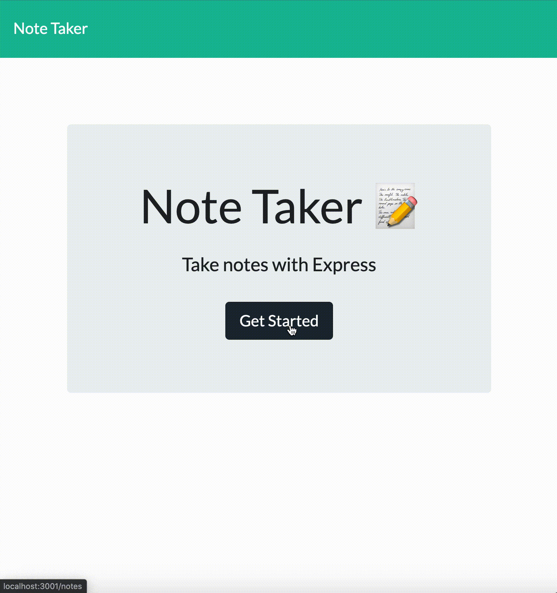

Simple Note Taker
====
[](https://opensource.org/licenses/MIT)

Description
---
By Weng Fei Fung. Simple note taker that lets you save, view, and delete notes. Deploys on an Express server.

Table of Contents
---
- [Description](#description)
- [Demo](#demo)
- [Screeenshots](#screenshots)
- [Installation](#installation)
- [Usage](#usage)
- [License](#license)
- [Contribution](#contribution)
- [Tests](#tests)
- [Questions](#questions)

Demo
---
[Open Simple Note Taker](https://simple-note-taker-wff.herokuapp.com/)

Screenshots
---


Installation
---
Deploy on heroku, your own web server, or localhost.

Web server:
```
nohup node ./server.js > /dev/null 2>&1 &
```

Localhost:
```
npm start
```

Usage
---
Visit / for the front page. /notes will list all notes.

### Localhost
Port will be 3001 on localhost: `localhost:3001`

License
---
[MIT License](https://opensource.org/licenses/MIT)

Contribution
---
If contributing, please make sure to create Jest Tests and Classes.

Tests
---
```
npm test
```

Questions
---
- Where can I see more of your repositories?
	- Visit [Siphon880gh's Repositories](https://github.com/Siphon880gh)


- Where can I reach you?
	- You can reach me with additional questions at <a href='mailto:weffung@ucdavis.edu'>weffung@ucdavis.edu</a>.
	- If interested in [hiring me](https://www.linkedin.com/in/weng-fung/).